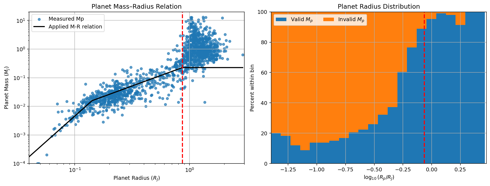
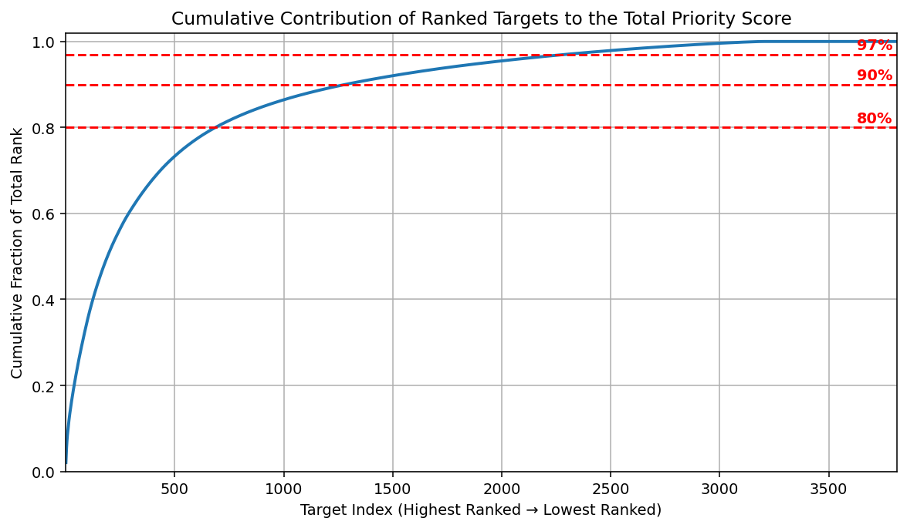
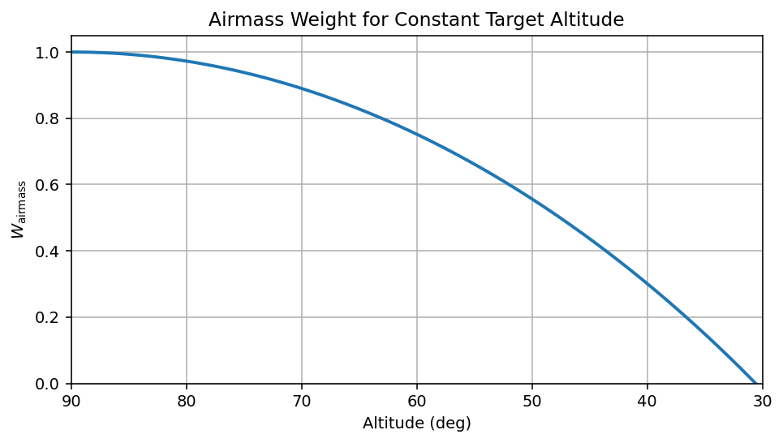
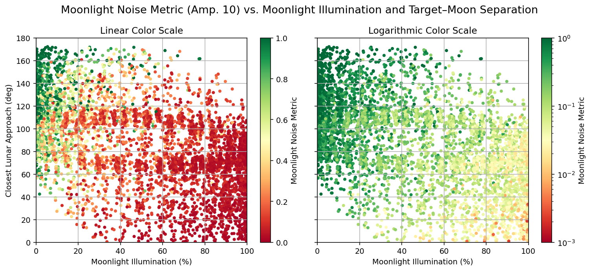
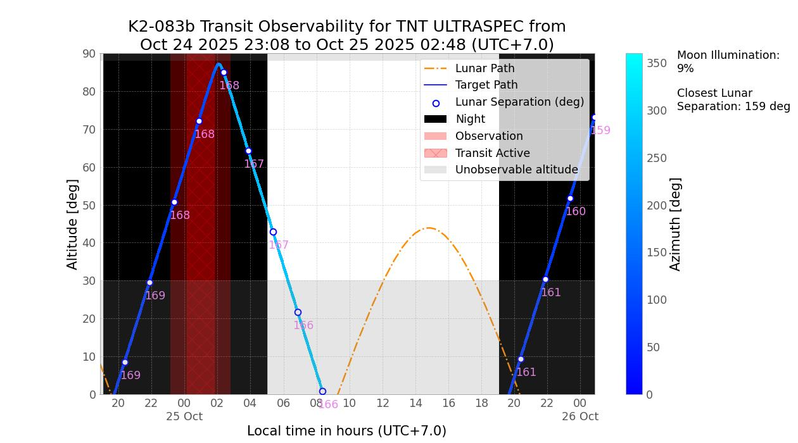

PREFACE Workflow
=================

This page describes the internal processing pipeline executed by :func:`~preface.run_preface`.
The pipeline is divided into two broad phases: **Phase One** selects the most promising
exoplanet targets by applying a selection metric, and **Phase Two** determines when those
targets are observable from the chosen telescope location. The final output is a ranked
list of transit events to direct observing efforts.

The sections below describe each processing step in the order it is executed.

.. contents::
   :local:
   :depth: 1

----

Phase One
---------------------------

Phase One produces a ranked subset of TEPCat planets deemed viable
for transmission spectroscopy. It proceeds through seven steps:

- ``ModCheck``: Assembles the TEPCat exoplanet catalogue
- ``ImpactMerger``: Recovers literature impact parameters from exoplanets.org
- ``ExoplanetseuImpactMerger``: Recovers literature impact parameters from exoplanets.eu
- ``WorkingTEPSetBuilder``: Calculates all remaining telescope- and time-independent parameters for selection metric calculation
- ``RankMaker``: Calculates the selection metric for each planet from the working TEPCat dataset
- ``Cutter``: Calculates the metric cutoff threshold, where planets with the metric lower than the threshold are deemed "non-viable"
- ``ViabilitySplitter``: Divides full ranked catalogue into two output catalogues deemed "viable" and "non-viable"

Step 1: ``ModCheck``
~~~~~~~~~~~~~~~~~~~~~~~~~~~~~~~~~~~~~~

The input catalogue is primarily drawn from the Transiting ExoPlanet Catalogue (TEPCat), maintained
by Dr John Southworth at Keele University. TEPCat was selected over alternatives such as
exoplanets.eu for two reasons critical to pipeline operation: it provides transit durations
(:math:`t_{14}`) for every entry, which is absent from most other catalogues yet
essential for Phase Two transit predictions, and it provides complete mid-transit ephemerides in BJD\ :sub:`TDB`,
which enables accurate prediction of future transit times.

TEPCat is distributed as three separate files:

- ``allplanets-csv.csv``: well-studied objects with full parameter sets.
- ``kepplanets-csv.csv``: less-studied objects, typically faint Kepler targets.
- ``observables.csv``: coordinates, magnitudes, ephemerides, durations, and depths for
  all planets in both of the above files.

First, ``ModCheck`` checks the modification timestamp of each local copy. If any file is older than
seven days, an updated version is downloaded from the TEPCat website before proceeding.
Then, the three files are read into ``pandas`` DataFrames, cleaned, and concatenated into a single
working table with consistent column headers. Any planet entry missing either transit duration (:math:`t_{14}`)
or transit depth (:math:`\delta`) is removed, as both quantities are required at multiple downstream stages.
Brown dwarf entries are also excluded. Finally, the cleaned catalogue is saved as ``FullTEPSet.csv`` and passed to the next step.

Step 2: ``ImpactMerger``
~~~~~~~~~~~~~~~~~~~~~~~~~~~~~~~~~~~~~~

The impact parameter :math:`b` is not provided by TEPCat's standard data files, yet it is
required by Phase Two's transit geometry model. This step performs a first-pass recovery by
cross-matching ``FullTEPSet.csv`` against the Exoplanet Orbit Database (exoplanets.org),
which was found to hold the largest number of literature :math:`b`-values at the time of
original pipeline development. Planet names are normalised between the two
catalogues to ensure consistent matching, and every planet that appears in both catalogues 
receives its literature impact parameter at this stage. The result is written out as
``FullTEPSetWithExoOrgImpacts.csv``.

Step 3: ``ExoplanetseuImpactMerger``
~~~~~~~~~~~~~~~~~~~~~~~~~~~~~~~~~~~~~~

For planets still missing :math:`b` after Step 2, a second cross-match is performed
against a snapshot of the exoplanets.eu catalogue (currently 24 June, 2026). Although this catalogue holds fewer
:math:`b`-values overall, it tends to be more up to date for recent discoveries. Planets
appearing in both catalogues receive their impact parameters in this pass. The updated
catalogue is saved as ``FullTEPSetWithAllImpacts.csv``.

.. note::
   At the time of initial deployment (September 2017), this two-pass recovery successfully retrieved
   literature impact parameters for 1,213 of 1,451 TEPCat entries (83.6%). The two
   external catalogue snapshots are static; the recovery rate may decline gradually as
   TEPCat continues to be updated with new discoveries.

Step 4: ``WorkingTEPSetBuilder``
~~~~~~~~~~~~~~~~~~~~~~~~~~~~~~~~~~~~~~

At this stage, the catalogue contains all available literature parameters but is still
missing several quantities required by the metric and by Phase Two. ``WorkingTEPSetBuilder``
derives these internally.

**Stellar magnitudes.** TEPCat provides V- and K-band magnitudes for parent stars, but
many instruments use filters outside these bands. Magnitudes in U, B, R, and I are
recovered by applying published spectral type conversion tables (Mamajek 2017; Pecaut &
Mamajek 2013) to each star's effective temperature and V-band magnitude. Sloan :math:`g`,
:math:`r`, :math:`i`, and :math:`z` magnitudes are recovered using the empirical colour
transformations of Jordi et al. (2007). Specialist longpass filters (e.g. the Liverpool
Telescope RISE 720 nm filter) are handled using a flux-additivity approximation.

**Semi-major axis.** Where not already present, the semi-major axis is computed from
Kepler's Third Law:

.. math::

   a = \left( \frac{P^2\, M_*}{M_\odot} \right)^{1/3}

where :math:`P` is the orbital period in years and :math:`M_*` is the stellar mass in
solar masses. The result is expressed in AU.

**Equilibrium temperature.** Planet equilibrium temperatures are computed assuming zero
Bond albedo:

.. math::

   T_\mathrm{eq} = T_\mathrm{eff} \cdot \sqrt{\frac{R_*}{2a}}

where :math:`T_\mathrm{eff}` is the stellar effective temperature and :math:`R_*` is the
stellar radius expressed in AU.

**Remaining impact parameters.** For the minority of planets for which :math:`b` could
not be recovered from either external catalogue in Steps 2-3, an estimate is computed
analytically using the transit geometry model of Seager & Mallén-Ornelas (2003):

.. math::

   b = \sqrt{
        \left(
            \frac {1 + \frac{R_p}{R_*}} {\cos \left[ \frac{\pi t_{14}}{P} \right] }
        \right)^2
       - \left(
            \frac{a}{R_*} \tan \left[ \frac{\pi t_{14}}{P} \right]
        \right)^2
   }

**Planet mass estimation.** Planetary masses cannot be derived using transit parameters alone, yet
mass is required by the metric calculation for planets. For planets lacking a literature mass, PREFACE
estimates :math:`M_p` from the planet's radius using the continuous mass-radius-temperature
relation of Edmondson et al. (2023):
 
.. list-table::
   :header-rows: 1
   :widths: 25 40 50
 
   * - Regime
     - Condition
     - Power-law applied
   * - Rocky
     - :math:`R_p < 1.580 \,R_\oplus`
     - :math:`M_p = \left(R_p / 1.01\right)^{1/0.28}\,M_\oplus`
   * - Neptunian
     - :math:`1.580 \leq R_p < 9.683\,R_\oplus`
     - :math:`M_p = \left(R_p / 0.53\right)^{1/0.68}\,M_\oplus`
   * - Jovian (degenerate)
     - :math:`R_p \geq 9.683\,R_\oplus`
     - :math:`M_p = 71.70\,M_\oplus`
 
The Neptunian-Jovian boundary is defined as the radius at which the mass-radius relation becomes degenerate for a Jovian planet
with an equilibrium temperature of :math:`T_\mathrm{eq} = 500\,\mathrm{K}`. Beyond this radius, the mass-radius relation becomes
degenerate, and a unique mass estimate is not recoverable from radius alone, therefore a conservative lower-bound mass estimate
at the boundary is given. The final estimated mass is then converted from Earth masses to Jupiter masses before being stored.

   **Figure.** Left: Planet mass as a function of planetary radius for the ranked target sample. Right: Distribution of planetary radii, showing the fraction of targets with measured (blue) and unmeasured (orange) masses within each radius bin.

Step 5: ``RankMaker``
~~~~~~~~~~~~~~~~~~~~~~~~~~~~~~~~~~~~

For each planet in the working catalogue, ``RankMaker`` uses the chosen instrument's detector
properties to compute an optimum exposure time and an approximate signal-to-noise ratio per planet.
These quantities are used to evaluate the Phase One selection metric, which ranks planets
by their expected spectroscopic return for the given instrument and filter combination.

Metric scores are computed for all four available metric modes simultaneously:

- ``Rank``: the standard photometric transmission spectroscopy metric (Morgan et al. 2019):

.. math::

   \mathcal{D} = C_{T}(\lambda) \cdot 10^{-0.2m_*} \cdot t_{14} \cdot \frac{T_\text{eq} R_p \delta}{M_p}

where

.. math::

   C_{T}(\lambda)
   = N_\lambda^{-1/2} \cdot 10^{0.2m_\text{zp}} \cdot
   \left(
      \frac{t_\text{exp}}{t_\text{exp} + t_\text{overhead}}
   \right)^{1/2}

contains all telescope-dependent variables.

- ``Habitable_Rank``: the standard metric restricted to planets in or near the habitable
  zone of their host star. This effectively sets :math:`T_\mathrm{eq} = 1` for all targets,
  which can be followed by an application of a temperature mask afterwards.
- ``Multi_Transit_Rank``: a metric weighted towards planets with frequent transits,
  suited to long-term monitoring campaigns:

.. math::

   \mathcal{D}_{\text{multi}} = \mathcal{D} \cdot P^{-1/2}

- ``Multi_Transit_Habitable_Rank``: the habitable-zone variant of the multi-transit
  metric.

The full catalogue is sorted by the standard ``Rank`` score from highest to lowest and
saved as a ranked CSV. All four metric columns are retained so that the user can switch
metric mode (via ``metric_mode``) without rerunning Phase One from scratch.

.. note::
   Exposure times and SNR values produced at this step are meaningful only in a relative
   sense. They are proportionality estimates used for ranking and are not a substitute for
   a dedicated exposure-time calculator when planning actual observations.

Step 6: ``Cutter``
~~~~~~~~~~~~~~~~~~~~~~~~~~~~~~~~~~~~

Because the Phase One metric is a proportionality rather than an absolute physical
quantity, a fixed, physically motivated viability threshold cannot be defined. Instead,
PREFACE uses the cumulative distribution of rank scores for a reference calibration
instrument to place a data-driven cut.

VLT/FORS2 (600RI+19 grism) is chosen as the calibration instrument for spectroscopy,
because they access the largest viable subsets of targets, making the calibration cut
as inclusive as possible. No corresponding calibration instrument is defined for photometry.

The ``Cutter`` evaluates the cumulative rank-score distribution for the calibration instrument
and identifies the minimum absolute rank score at which the cumulative fraction equals
``viable_cumulative_cut`` (e.g. ``0.97``). This threshold score is returned and passed
to the ``ViabilitySplitter``.

   **Figure.** Cumulative fraction of the total ranking score contributed by the ranked target list. Horizontal dashed lines indicate the 0.80, 0.90, and 0.97 cumulative score thresholds.

Step 7: ``ViabilitySplitter``
~~~~~~~~~~~~~~~~~~~~~~~~~~~~~~~~~~~~

Using the threshold score from the Cutter, ``ViabilitySplitter`` divides the full ranked
catalogue into two output files:

- **Viable targets**: planets scoring at or above the threshold for the user's chosen
  instrument. These are passed to Phase Two for transit scheduling.
- **Non-viable targets**: planets below the threshold. These are written to the
  ``nonviable_target_list/`` output directory for reference but take no further part in
  the pipeline.

Both files are saved to the ``phase_1/`` output directory. The number of viable targets
depends on both the chosen instrument and the value of ``viable_cumulative_cut``; a cut
of ``0.90`` to ``0.97`` is recommended as it captures all planets in the productive upper
"knee" of the cumulative distribution while excluding the long low-viability tail.

----

Phase Two
------------------------------

Phase Two takes the viable target list produced by Phase One and returns a ranked schedule
of observable transit events within the user-specified observing window. For each planet,
it propagates the transit ephemeris forward, evaluates every predicted event against
astronomical night and altitude constraints, scores each observable event using an airmass-
weighted transit coverage model and a moonlight noise model, and combines these with the
Phase One metric score to produce a final event weight.

Phase Two is the most computationally intensive stage of the pipeline, running at
approximately 1-2 seconds per target for a viable target list of ~1000 planets in
an 8-month observation window. Multiprocessing is applied at this stage using ``joblib``,
distributing the workload across available CPU cores as configured by
:class:`~preface.configs.MultiprocessingConfigurations`.

PhaseTwo proceeds through three steps:

- ``MultiprocessingWrapper``: Initializes necessary lookup tables and ``joblib`` multiprocessing for Phase Two 
- ``MultiprocessingProcess``: For each planet, find and rank viable transit events in the given observing window
- ``PostCleaner``: Assembles ``MultiprocessingProcess`` outputs for each planet, then generates two final ranked transit datasets

Step 1: ``MultiprocessingWrapper``
~~~~~~~~~~~~~~~~~~~~~~~~~~~~~~~~~~~~

In order to reduce per-planet runtime during ``MultiprocessingProcess``, ``MultiprocessingWrapper`` first
constructs the necessary lookup tables to be used across all parallel jobs, then dispatches those jobs via ``joblib``.

The following preparatory steps are executed in the following sequence:

**IERS table update.** Downloads or refreshes the IERS-A Earth orientation table required by Astropy for
accurate coordinate transformations, falling back to an IERS mirror on network timeout.
The cached copy is refreshed automatically if older than 7 days.

**Telescope location & timezone resolution.** Gathers the IANA timezone of the telescope via its stored latitude
and longitude for local-time handling during graphical output during multiprocessing.

**Sun & Moon AltAz lookup table.** Precomputes Sun and Moon altitude/azimuth for every minute across the provided
observation window (padded by 2 days). Positions are first computed at 10-minute precision in the local ``AltAz`` frame,
then up-sampled to 1-minute resolution via cubic spline interpolation in Cartesian coordinates. Saved as a compressed Parquet file.

**Lunar brightness lookup table.** If ``toggle_moonlight_noise`` is enabled, precomputes the Moon's hourly apparent magnitude
using the Allen (1976) empirical phase-angle formula

.. math::

   m_\text{moon} (\lambda, \phi) = m_\text{full moon} (\lambda) + 0.026|\phi| + 4 \times 10^{-9} \cdot \phi^4

with lunar phase angles :math:`\phi` from ``pyephem`` and per-filter full-Moon magnitudes
empirically calculated from Toledano et al. (2024)'s LIME toolbox sampling during October 2025 to May 2026 at TNT ULTRASPEC.
Per-filter effective wavelengths :math:`\lambda` are retrieved from Bessell et al. (1998) and Fukugita et al. (1996).
Saved as a compressed Parquet file.

With all lookup tables in place, ``MultiprocessingProcess`` is then dispatched per viable planet as a ``joblib`` job, with progress
tracked via ``tqdm``.

Step 2: ``MultiprocessingProcess``
~~~~~~~~~~~~~~~~~~~~~~~~~~~~~~~~~~~~

``MultiprocessingProcess`` is the core computational step of Phase Two, and the most computationally
expensive section of the PREFACE pipeline. For this reason, it is dispatched once per viable planet as a
``joblib`` job. ``MultiprocessingProcess`` is divided into the following subprocesses: ephemeris propagation, 
transit contact times calculation, target local coordinate computation, nighttime observability classification,
airmass-weighted scoring, transit coverage scoring, moonlight noise scoring, final transit decision metric
scoring, and optional graphical output for every predicted transit event within the observing window.

.. note::
   TEPCat ephemerides are given in Barycentric Julian Date in Barycentric Dynamical Time
   (BJD\ :sub:`TDB`), which can differ from standard UTC by up to approximately 10 minutes
   due to relativistic corrections and accumulated leap seconds. This offset is appropriately
   handled internally within the pipeline.

**Ephemeris propagation.**
Transit first-contact times :math:`T_1` are propagated forward from the TEPCat reference
ephemeris. The reference mid-transit time :math:`T_0` (in BJD\ :sub:`TDB`) is converted to a
first-contact time by subtracting half the transit duration :math:`t_{14}`, and the integer
epoch range spanning the observing window is computed. For each epoch :math:`n`, the transit
start time :math:`T_{1,n}` and its associated timing uncertainty :math:`\sigma_n` are

.. math::

   T_{1,n} = T_{1,0} + n \cdot P

.. math::

   \sigma_n = \sqrt{\sigma_{T_0}^2 + \left( n \cdot \sigma_P \right)^2}

**Transit contact time calculation.**
For each predicted transit, the four contact times are derived from the transit geometry. The
mid-transit :math:`T_0` and fourth contact :math:`T_4` follow directly from :math:`T_1` and
:math:`t_{14}`

.. math::

   T_0 = T_1 + (0.5 \cdot t_{14}), \qquad T_4 = T_1 + t_{14}

The internal contacts :math:`T_2` and :math:`T_3` are derived from the transit
geometry model of Seager & Mallén-Ornelas (2003), from which

.. math::

   t_{23} = \frac{P}{\pi} \arcsin \left( \frac{ \sqrt{(R_*-R_p)^2 - (bR_*)^2} }{a} \right)

and the ingress/egress duration

.. math::

   t_{12} = \frac{|t_{14} - t_{23}|}{2}

follows. Subsequently,

.. math::

   T_2 = T_1 + t_{12}, \qquad T_4 = T_4 - t_{12}

For grazing transits where impact parameter :math:`b = 0` and :math:`T_2`
is unphysical, :math:`T_2` and :math:`T_3` are both set to :math:`T_0` and the event
is treated as having no flat bottom.

Finally, One-hour baseline windows are appended on either side of the transit:

.. math::

   T_\mathrm{BaseStart} = T_1 - 1\,\mathrm{hr}, \qquad T_\mathrm{BaseEnd} = T_4 + 1\,\mathrm{hr}

**Target local coordinate computation.**
The target's altitude and azimuth over time are computed for a 30-hour window (from 12 hours before closest
midnight to 18 hours after) via Astropy's ``transform_to()`` method. To minimise per-event overhead, all time
windows are batched and the altitude/azimuth coordinate transforms are performed simultaneously at
10-minute resolution in a single vectorised call, then interpolated to 1-minute resolution via cubic spline
in Cartesian coordinates. Sun and Moon positions are drawn directly from the precomputed lookup table.

**Nighttime observability classification.**
First, the start and end of astronomical night are identified by detecting zero-crossings of the
Sun's altitude profile relative to the :math:`-18°` astronomical twilight threshold, distinguishing
sunfall (descending) from sunrise (ascending) crossings. Several multi-night edge cases are
handled explicitly such that the night starts/ends are bounded by the 30-hour window and contain
the corresponding transit's mid-transit time.

Then, four binary altitude spot-check conditions are evaluated over the transit time window,
nighttime window, and transit-night overlap windows.

- *Target reaches minimum altitude:* target exceeds observable altitude at any point during the transit
  or night.
- *Target above minimum altitude for entire transit:* target remains above :math:`30°`
  throughout the full transit-plus-baseline window.
- *Target reaches minimum altitude at night:* target exceeds :math:`30°` at some point during
  the observing night.
- *Target reaches minimum altitude during transit at night:* target exceeds :math:`30°` during
  the overlap of the transit window and the night.

These conditions are combined into **strict** (``F``) and **lax** (``P``) altitude sets and
evaluated against timing conditions on how the transit overlaps the night, producing one of the
following internal rank markers:

.. list-table::
   :header-rows: 1
   :widths: 15 85

   * - Rank
     - Condition
   * - ``03_F``
     - Night contains full transit + baselines.
       |br| Full transit + baselines always above observable altitude.
       |br| Target visible at some point during night.
   * - ``03_P``
     - Night contains full transit + baselines.
       |br| Full transit + baselines at observable altitude during transit or during night.
       |br| Transit observable at some point during night.
   * - ``02_F``
     - Night contains full transit but not full baselines.
       |br| Full transit + baselines always above observable altitude.
       |br| Target visible at some point during night.
   * - ``02_P``
     - Night contains full transit but not full baselines.
       |br| Full transit + baselines at observable altitude during transit or during night.
       |br| Transit observable at some point during night.
   * - ``01_F``
     - Night contains partial transits.
       |br| Full transit + baselines always above observable altitude.
       |br| Target visible at some point during night.
   * - ``01_P``
     - Night contains partial transits.
       |br| Full transit + baselines at observable altitude during transit or during night.
       |br| Transit observable at some point during night.
   * - ``X``
     - No part of the transit is observable. Event is discarded.

.. |br| raw:: html

    

where the "minimum observable altitude" is :math:`30°`, which corresponds to an airmass of 2.
The classification follows a top-down hierarchy: the strictest condition (``03_F``) is tested
first, and the event falls through until a matching condition is found.

**Integration limits.**
For events ranked ``01`` or above, the usable observing window is bounded by integration limits
:math:`L_1` and :math:`L_2`, defined as whichever is more
restrictive between astronomical night and the times at which the target crosses the minimum
observable altitude.

For ``F``-ranked events, where the target remains above :math:`30°` throughout the transit:

.. math::

   L_1 = \max\left( T_\mathrm{BaseStart},\; T_\mathrm{sunfall} \right), \qquad
   L_2 = \min\left( T_\mathrm{BaseEnd},\; T_\mathrm{sunrise} \right)

For ``P``-ranked events, the minimum-altitude crossing time(s) of the target's path are
identified by detecting zero-crossings of altitude relative to :math:`30°`. A conditional logic
gate handles scenarios including one or two crossing points, a rising or setting target, and
varying orderings of the sunfall, altitude crossing, and transit contact times. Any event for which
:math:`L_2 \leq L_1` after limit assignment is downgraded to rank ``X`` and discarded.

**Airmass-weighted scoring.**
The atmospheric seeing PSF :math:`\Theta` scales with airmass :math:`X = \csc(i)` at an altitude angle
of :math:`i`, as :math:`\Theta \propto \lambda^{-1/5} \cdot X^{3/5}`. To penalise events at low altitude,
an airmass weight is computed by the inverse of an intergral that describes how the airmass changes over the
usable observing window:

.. math::

   W_\mathrm{airmass} = 3 \left( \frac{L_2-L_1}{\int_{L_1}^{L_2}X(t)^{3/5} dt} - \frac{2}{3} \right)

The weight is amended to return a value of 1 for targets constantly at the zenith, decline steeply as
altitude decreases, and have a value of 0 for targets constantly at :math:`30^\circ` altitude.

   **Figure.** Airmass weighting function for a target observed at a constant altitude.

**Transit coverage scoring.**
Baseline coverage before and after the transit is essential for fitting the light curve and
recovering limb-darkening parameters. The observable fraction of each of five segments within
:math:`[L_1, L_2]` is evaluated:

1. Pre-transit baseline (:math:`T_\mathrm{BaseStart}` to :math:`T_1`)
2. Ingress (:math:`T_1` to :math:`T_2`)
3. Full mid-transit (:math:`T_2` to :math:`T_3`)
4. Egress (:math:`T_3` to :math:`T_4`)
5. Post-transit baseline (:math:`T_4` to :math:`T_\mathrm{BaseEnd}`)

For each segment, the observable sub-interval is clipped to the overlap of the segment with
the visibility window :math:`[L_1, L_2]`:

.. list-table::
   :header-rows: 1
   :widths: 30 45 45

   * - Segment
     - Lower clipped limit
     - Upper clipped limit
   * - Pre-transit baseline
     - :math:`L_{\mathrm{BS}1} = \max(L_1,\,T_\mathrm{BaseStart})`
     - :math:`L_{\mathrm{BS}2} = \min(L_2,\,T_1)`
   * - Ingress
     - :math:`L_{\mathrm{In}1} = \max(L_1,\,T_1)`
     - :math:`L_{\mathrm{In}2} = \min(L_2,\,T_2)`
   * - Full mid-transit
     - :math:`L_{\mathrm{Tr}1} = \max(L_1,\,T_2)`
     - :math:`L_{\mathrm{Tr}2} = \min(L_2,\,T_3)`
   * - Egress
     - :math:`L_{\mathrm{Eg}1} = \max(L_1,\,T_3)`
     - :math:`L_{\mathrm{Eg}2} = \min(L_2,\,T_4)`
   * - Post-transit baseline
     - :math:`L_{\mathrm{BE}1} = \max(L_1,\,T_4)`
     - :math:`L_{\mathrm{BE}2} = \min(L_2,\,T_\mathrm{BaseEnd})`

In cases where the segment lies entirely outside the visibility window, both the clipped limits are set to zero.

These clipped lengths are combined into three weight components:

.. math::

   W_\mathrm{base}  &= \frac{(L_{\mathrm{BS}2} - L_{\mathrm{BS}1})
                              + (L_{\mathrm{BE}2} - L_{\mathrm{BE}1})}{\text{2 hr}} \\
   W_\mathrm{trans} &= \frac{L_{\mathrm{Tr}2} - L_{\mathrm{Tr}1}}{T_3 - T_2} \\
   W_\mathrm{inout} &= \frac{(L_{\mathrm{In}2} - L_{\mathrm{In}1})
                              + (L_{\mathrm{Eg}2} - L_{\mathrm{Eg}1})}{2\,(T_2 - T_1)}

To which the composite event weight is:

.. math::

   W_\mathrm{event} = W_\mathrm{base} \cdot W_\mathrm{trans} \cdot W_\mathrm{inout}

For grazing transits (:math:`T_2 = T_3`, so :math:`W_\mathrm{trans}` is undefined), the
mid-transit term is omitted:

.. math::

   W_\mathrm{event} = W_\mathrm{base} \cdot W_\mathrm{inout}

**Moonlight noise scoring.**
If ``toggle_moonlight_noise`` is enabled, a moonlight noise weight is computed using the atmospheric
scattering model of Winkler (2022), incorporating both Rayleigh and Mie scattering components.
The scattered moonlight intensity after one-time scattering :math:`I_{L1}` (in flux/arcsec\
:sup:`2`) is modelled as:

.. math::

   I_{L1} = p(\theta) \cdot F^*_L  \cdot \frac{\tau_R + \tau_M}{\tau}  \cdot
             \sec\zeta\, \frac{e^{-\tau \sec\zeta} - e^{-\tau \sec z}}{\sec z - \sec\zeta}

where the composite scattering phase function :math:`p(\theta)` is a weighted combination of the
Rayleigh and Mie phase functions:

.. math::

   p(\theta) &= \frac{\tau_R\, p_R(\theta) + \tau_M\, p_M(\theta)}{\tau_R + \tau_M} \\
   p_R(\theta) &= \frac{1}{4\pi} \frac{3(1-\chi)}{4(1+2\chi)}
                  \left[\frac{1+3\chi}{1-\chi} + \cos^2\theta\right] \\
   p_M(\theta) &= \frac{1}{4\pi} \frac{1-g^2}{(1+g^2-2g\cos\theta)^{3/2}}

The quantities appearing in these expressions are defined as follows:

.. list-table::
   :header-rows: 1
   :widths: 10 70

   * - Symbol
     - Description
   * - :math:`F^*_L`
     - Top-of-atmosphere (TOA) lunar flux (in flux),
       |br| retrieved from precomputed lunar brightness LUT at start of observation
   * - :math:`\zeta`
     - Zenith angle of the observation target
   * - :math:`z`
     - Zenith angle of the Moon
   * - :math:`\theta`
     - Moon-target angular separation angle
   * - :math:`\tau_R`
     - Rayleigh scattering optical depth
   * - :math:`\tau_M`
     - Mie (aerosol) scattering optical depth,
       |br| sourced from the configurable ``scattering_aod`` parameter
   * - :math:`\tau_A`
     - Absorption optical depth,
       |br| sourced from the configurable ``absorption_aod`` parameter
   * - :math:`\tau`
     - Total optical depth (:math:`\tau = \tau_R + \tau_M + \tau_A`)
   * - :math:`\chi`
     - Rayleigh depolarisation factor, fixed at :math:`\chi = 0.0148`
   * - :math:`g`
     - Aerosol asymmetry factor,
       |br| sourced from the configurable ``asymmetry_factor`` parameter;
       |br| typically in the range 0.5-0.8

.. |br| raw:: html

    

The Rayleigh scattering optical depth is computed from the instrument altitude and filter
wavelength as:

.. math::

   \tau_R = e^{-h/H}\,(1.229 \times 10^{10})\,\lambda^{-4.05}

where :math:`h` is the instrument altitude in metres, :math:`H = 8500` m is Earth's scale
height, and :math:`\lambda` is the filter's effective wavelength in nm.

The scattered moonlight intensity :math:`I_{L1}` is then converted from flux/arcsec\
:sup:`2` to mag/arcsec\ :sup:`2` (:math:`\mu_\mathrm{bg,moon}`) using filter flux
zeropoints. The sky brightness contribution over a sky patch of area :math:`A`
(arcsec\ :sup:`2`) is:

.. math::

   m_\mathrm{bg,moon} = \mu_\mathrm{bg,moon} - 2.5\log(A)

The SNR reduction factor, referred to as the moonlight noise weight, is then derived from the
ratio of the new and old detectability scores :math:`\mathcal{D}`, which are directly
proportional to the SNR. The resulting moonlight noise weight is:

.. math::

   W_\mathrm{Moon} = \left(1 + \frac{10^{-0.4(m_\mathrm{bg,moon} - \gamma)}}
                     {10^{-0.4 m_*} + 10^{-0.4 m_\mathrm{sky}}}\right)^{-0.5}

where :math:`\gamma` is a configurable "moonlight amplification factor" that adjusts the effective
moon background brightness to provide stronger suppression under bright moonlight conditions.
The default value (:math:`\gamma = 10`) is calibrated such that, for a full-moon sky
background of :math:`\mu_\mathrm{bg,moon} = 17\,\mathrm{mag/arcsec^2}`, a sky patch of
area :math:`A = 10\,\mathrm{arcsec^2}`, and a target of magnitude
:math:`m_* = 12`, the resulting moonlight noise weight is approximately
:math:`W_\mathrm{Moon} \approx 0.1`.

   **Figure.** Moonlight noise metric (Default aerosol parameters, Amplification factor 10) as a function of lunar illumination and the closest Moon-target separation. If you find the suppression too aggressive, try reducing the amplification factor to 8-9.

If ``toggle_moonlight_noise`` is disabled, :math:`W_\mathrm{Moon} = 1`.

**Final transit decision metric.**
Finally, the final decision metric for a given transit event is the product of four terms:

.. math::

   \mathcal{D}_\mathrm{final} = \mathcal{D} \cdot W_\mathrm{airmass} \cdot W_\mathrm{event} \cdot W_\mathrm{Moon}

where :math:`\mathcal{D}` is the Phase One metric score for the planet under the chosen
``metric_mode``. This formulation ensures the final ranking reflects both the intrinsic
spectroscopic value of a target (Phase One) and the practical quality of the specific observing
opportunity (Phase Two).

**Graphical output.**
If ``toggle_graph_outputs`` is enabled and the event weight :math:`W_\mathrm{event}` meets or exceeds
``event_weight_graph_threshold``, a sky chart is generated showing the target's altitude path
(coloured by azimuth), the Moon's path, the observing night bounded by astronomical twilight,
the transit window and baseline shaded in red, and altitude floor and ceiling limits. Moon illumination
and closest lunar separation are annotated. Plots are saved as JPG files in ``phase_2/graph/`` per transit
labelled with the event weight, internal rank, planet name, instrument, and transit time in local time.

   **Figure.** Example graphical output for K2-83b predicted at TNT ULTRASPEC.

**Per-planet output.**
All computed quantities (contact times, internal rank, UTC observation start and end, airmass
metric, segment weights, event weight, moon noise metric, and final metric) are written to an
individual CSV in ``phase_2/individual_planets/``. Internal state lists are cleared at the end
of each planet's processing to prepare for the next job.

Step 3: ``PostCleaner``
~~~~~~~~~~~~~~~~~~~~~~~~~~~~~~~~~~~~

Once all per-planet event files have been generated by the multiprocessing pool,
``PostCleaner`` assembles the final pipeline outputs:

**Full event list.** All per-planet CSV files are read then merged into a single DataFrame.
Unobservable events (internal rank ``X``) are removed. The remaining events are sorted by
final transit metric :math:`\mathcal{D}_\mathrm{final}` from highest to lowest and
written to ``phase_2/full_ranked_event_list/``. This file is the primary output of the pipeline
and can be used directly to construct observing schedules.

**Cumulative observability scores.** For each planet, all events for which event weight
:math:`W_\mathrm{event} > 0.5` (full transit capture with at least 50% baseline coverage
on both sides) are identified. Their :math:`\cal{D}_\mathrm{final}` scores are summed
to produce a "cumulative observability score", and the total count of qualifying events is
recorded. These results are written to ``phase_2/cumulative_observability_scores/``.

This product is intended to help campaign planners distinguish between planets that offer
a single high-priority window and those that present multiple well-scored opportunities
throughout the observation window.

.. note::
   Intermediate CSV files written to the pipeline's internal data store during the run
   can be removed after completion using :func:`~preface.wipe_intermediate_csvs`.
